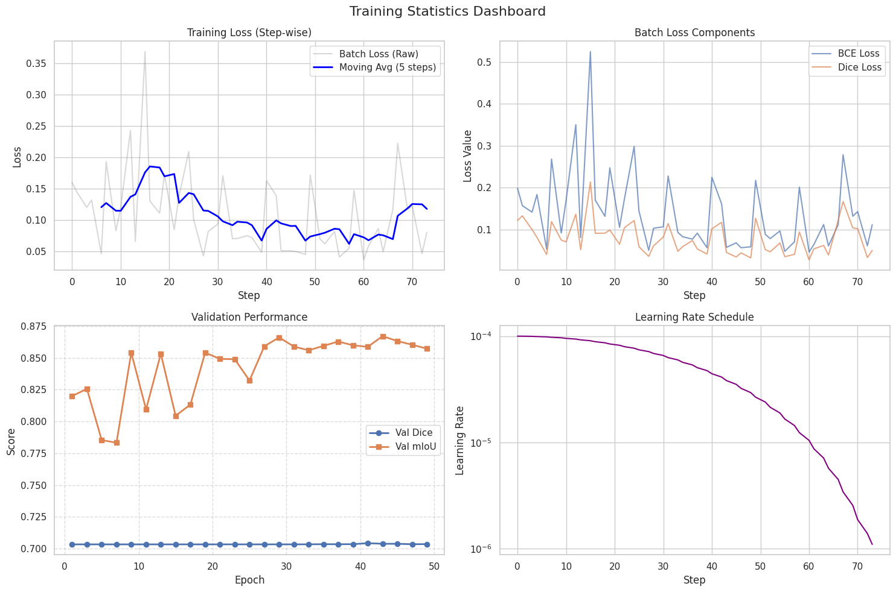

# SAM4Food: Food Segmentation with LoRA Fine-tuned SAM

Fine-tuning the Segment Anything Model (SAM) with LoRA adapters for food image segmentation.

**Branch `feature/foodinsseg-sem`:** extends the binary [FoodSeg103](#foodseg103-binary-segmentation-default) pipeline with **ingredient-aware segmentation** on [FoodInsSeg](#foodinsseg-ingredient-mode) (classification head + prompted aggregation). See [SAM4Food-Sem](#sam4food-sem-ingredient-aware-segmentation).

---

## Table of Contents

1. [Prerequisites](#prerequisites)
2. [Installation](#installation)
3. [Dataset Setup](#dataset-setup)
4. [Quick Start](#quick-start)
5. [Training](#training)
6. [Inference](#inference)
7. [SAM4Food-Sem: Ingredient-Aware Segmentation](#sam4food-sem-ingredient-aware-segmentation)
8. [Results](#results)
9. [Acknowledgments](#acknowledgments)

---

## Prerequisites

- **Python**: 3.10+
- **CUDA**: 11.7+ (for GPU training, optional but recommended)
- **Conda**: Miniconda or Anaconda
- **GPU Memory**: 16GB+ recommended for training

---

## Installation

### Option 1: Automated Setup (Recommended)

Run the setup script which handles environment creation, checkpoint downloads, and directory setup:

```bash
git clone https://github.com/jasongong111/SAM4Food.git
cd SAM4Food

# Run automated setup
bash setup.sh
```

The script will:
- Create conda environment `sam4food`
- Download SAM ViT-B checkpoint (~375MB)
- Download pre-trained LoRA weights from HuggingFace
- Create required directories

After setup, activate the environment:
```bash
conda activate sam4food
```

### Option 2: Manual Setup

```bash
# Create conda environment
conda env create -f environment.yml
conda activate sam4food

# Or use pip
pip install -r requirements.txt
```

### Download Model Checkpoints

**SAM Base Model** (required):
```bash
# ViT-B (~375MB)
wget https://dl.fbaipublicfiles.com/segment_anything/sam_vit_b_01ec64.pth
```

**Pre-trained LoRA Weights** (For inference without training):
```bash
mkdir -p checkpoints
curl -L -o checkpoints/best_model.pth \
  "https://huggingface.co/JasonGong111/SAM4Food/resolve/main/best_model.pth?download=true"
```

---

## Dataset Setup

### FoodSeg103 (binary segmentation, default)

Download the dataset from: https://github.com/L1016517444/FoodSeg103

Extract and organize with this structure:

```
data/FoodSeg103/
├── Images/
│   ├── img_dir/
│   │   ├── train/        # Training images (.jpg)
│   │   └── test/         # Test images (.jpg)
│   └── ann_dir/
│       ├── train/        # Training masks (.png)
│       └── test/         # Test masks (.png)
├── ImageSets/
│   ├── train.txt         # Training image IDs
│   └── test.txt          # Test image IDs
└── category_id.txt       # Category definitions
```

### FoodInsSeg (ingredient mode)

Use this dataset when training or evaluating with `--use_ingredient_head` and `--dataset_name FoodInsSeg`. Layout and CLI examples are documented under [SAM4Food-Sem](#sam4food-sem-ingredient-aware-segmentation).

---

## Quick Start

### Run Inference with Pre-trained Model

Use the pre-trained LoRA weights to segment food images immediately:

```bash
# Ensure you have both checkpoints:
# - sam_vit_b_01ec64.pth (SAM base model)
# - checkpoints/best_model.pth (LoRA weights)

python inference.py
```

Or use the Jupyter notebook for interactive inference:
```bash
jupyter notebook inference.ipynb
```

### Train a New Model

```bash
python main.py --mode train \
  --sam_checkpoint sam_vit_b_01ec64.pth \
  --model_name vit_b \
  --epochs 50
```

---

## Training

### Basic Training Command

```bash
python main.py --mode train \
  --sam_checkpoint sam_vit_b_01ec64.pth \
  --model_name vit_b \
  --epochs 50 \
  --batch_size 4 \
  --learning_rate 1e-4
```

### Training with Custom Settings

```bash
python main.py --mode train \
  --sam_checkpoint sam_vit_b_01ec64.pth \
  --model_name vit_b \
  --epochs 100 \
  --batch_size 8 \
  --learning_rate 5e-5 \
  --lora_rank 16 \
  --dataset_path /path/to/FoodSeg103
```

### Resume Training from Checkpoint

```bash
python main.py --mode train \
  --sam_checkpoint sam_vit_b_01ec64.pth \
  --resume checkpoints/best_model.pth \
  --epochs 100
```

### Full Pipeline (Train + Evaluate + Visualize)

```bash
python main.py --mode full \
  --sam_checkpoint sam_vit_b_01ec64.pth \
  --epochs 50
```

### All CLI Arguments

| Argument | Default | Description |
|----------|---------|-------------|
| `--mode` | `train` | `train`, `eval`, `visualize`, or `full` |
| `--model_name` | `vit_b` | SAM backbone: `vit_b`, `vit_l`, `vit_h` |
| `--sam_checkpoint` | (required) | Path to base SAM weights (`--model_path` is accepted as a legacy alias) |
| `--trained_checkpoint` | — | Trained LoRA/task checkpoint; required for `eval` and `visualize` |
| `--resume` | — | Resume training from this checkpoint |
| `--epochs` | 50 | Training epochs |
| `--batch_size` | 4 | Batch size |
| `--learning_rate` | 1e-4 | Learning rate |
| `--lora_rank` | 8 | LoRA rank; use `0` for head-only ablation (no LoRA) in ingredient mode |
| `--use_ingredient_head` / `--no_use_ingredient_head` | config | Enable ingredient classification head |
| `--num_ingredient_classes` | config | Number of ingredient classes |
| `--ingredient_head_hidden_dim` | config | Ingredient MLP hidden width |
| `--classification_loss_weight` | config | Weight for classification loss |
| `--mask_loss_weight` | config | Weight for mask loss |
| `--dataset_name` | config | e.g. `FoodSeg103` or `FoodInsSeg` |
| `--dataset_path` | — | Root path to the dataset |
| `--image_size` | 1024 | Input resolution |
| `--device` | `auto` | `auto`, `cuda`, or `cpu` |
| `--num_workers` | 4 | DataLoader workers |
| `--debug` | off | Small/debug runs |
| `--no_wandb` | off | Disable Weights & Biases |
| `--output_dir` | `outputs` | Outputs and logs |
| `--use_prompted_aggregation` / `--no_use_prompted_aggregation` | config | Ingredient-mode aggregation |
| `--aggregation_score_threshold` | config | Min score to keep a mask in aggregation |
| `--aggregation_iou_threshold` | config | IoU merge threshold |
| `--max_prompts_per_image` | config | Cap on prompts per image |
| `--visualization_samples` | 20 | Samples for `visualize` / `full` |

---

## Inference

### Using Python Script

Edit `inference.py` to set your checkpoint paths:

```python
# Set the path to SAM base checkpoint
config.model.sam_checkpoint_path = "sam_vit_b_01ec64.pth"

# Set the path to trained LoRA checkpoint
lora_checkpoint_path = "checkpoints/best_model.pth"
```

Then run:
```bash
python inference.py
```

The notebook provides interactive inference with visualization.

---

## Results

### Training Curves



## Acknowledgments

- [Segment Anything Model (SAM)](https://github.com/facebookresearch/segment-anything) by Meta AI
- [FoodSeg103 Dataset](https://github.com/L1016517444/FoodSeg103)
- [PEFT](https://github.com/huggingface/peft) for parameter-efficient fine-tuning

---

## SAM4Food-Sem: Ingredient-Aware Segmentation

### Overview

SAM4Food-Sem extends the binary food segmentation pipeline with **ingredient-level recognition**. The approach combines:

- **SAM + LoRA**: SAM's image encoder and mask decoder, fine-tuned with low-rank adapters (LoRA) for food images.
- **Ingredient head**: A lightweight linear classification head attached to each mask proposal, predicting one of the 103 FoodInsSeg ingredient categories.
- **Prompted aggregation**: Multiple SAM prompts (one per candidate instance) are run, and the resulting `(mask, class_id, confidence)` triples are merged via non-maximum suppression into a single semantic map.
- **Named outputs**: The final semantic map is rendered with colored per-ingredient overlays and text labels using `visualize_semantic_map` / `colorize_semantic_map` from `src/utils/visualization.py`.

### FoodInsSeg Dataset Setup

Download the FoodInsSeg dataset and arrange it in the following structure before training or evaluation:

```
FoodInsSeg/
├── ImageSets/
│   ├── train.txt      # newline-separated image IDs for training
│   ├── val.txt        # newline-separated image IDs for validation
│   └── test.txt       # newline-separated image IDs for testing
├── JPEGImages/        # source images as .jpg files (named by image ID)
├── Annotations/       # per-image JSON annotation files
└── class_names.json   # {"class_id": "ingredient_name", ...} mapping
```

Pass `--dataset_path /path/to/FoodInsSeg` and `--dataset_name FoodInsSeg` to `main.py`.

### Training

**Train with ingredient head (FoodInsSeg + LoRA):**

```bash
python main.py --mode train --sam_checkpoint sam_vit_b_01ec64.pth \
  --use_ingredient_head --dataset_name FoodInsSeg --dataset_path /path/to/FoodInsSeg \
  --batch_size 1
```

**Head-only ablation (ingredient head, no LoRA):**

> **Note:** Head-only ablation (frozen SAM, no LoRA, ingredient head only) is supported via
> `--lora_rank 0`. This sets the LoRA rank to 0, effectively disabling the LoRA adapters.

Checkpoints are saved to `checkpoints/` after each epoch; the best validation checkpoint is written to `checkpoints/best_model.pth`.

### Evaluation

```bash
python main.py --mode eval --sam_checkpoint sam_vit_b_01ec64.pth \
  --trained_checkpoint checkpoints/best_model.pth \
  --use_ingredient_head --dataset_name FoodInsSeg --dataset_path /path/to/FoodInsSeg
```

Reports per-class and mean IoU across the 103 ingredient categories.

### Aggregation Inference (Programmatic)

For running ingredient-aware inference on a single image programmatically, use `run_ingredient_inference` from `inference.py`:

```bash
python inference.py
```

The `run_ingredient_inference(model, image_tensor, prompts_list, config, class_names=None)` function accepts a list of prompt dicts (one per candidate region), runs each through the model, and aggregates the results into a single `semantic_map` (LongTensor, H×W) and a list of accepted `class_names`.

### Named Segmentation Output

After running `run_ingredient_inference`, render the result with ingredient name labels using the standalone visualization utilities:

```python
from src.utils.visualization import visualize_semantic_map, colorize_semantic_map

# semantic_map: LongTensor or numpy (H, W) with class IDs
# class_names_dict: {class_id: "ingredient_name"}
fig = visualize_semantic_map(image_np, semantic_map, class_names_dict,
                             save_path="output_named.png",
                             title="Ingredient Segmentation")
```

- `colorize_semantic_map(semantic_map, num_classes=103)` returns a `(H, W, 3)` uint8 RGB array with a consistent, seed-fixed color per ingredient class (background = black).
- `visualize_semantic_map(...)` renders the image with a blended color overlay, places ingredient name labels at region centroids (regions ≥ 100 px), and draws a legend panel listing color → ingredient name.

### Binary Baseline

The original binary food segmentation pipeline (FoodSeg103 dataset, no ingredient head) remains fully functional with the default configuration:

```bash
python main.py --mode train --sam_checkpoint sam_vit_b_01ec64.pth
python inference.py
```

### Further Reading

- Implementation notes and task history: `docs/superpowers/handoffs/2026-03-17-sam4food-sem-handoff.md`
